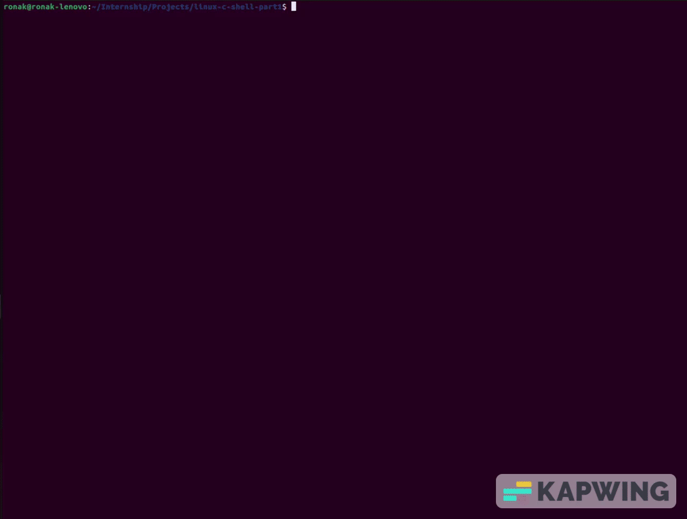

# This repository contains a Linux C Shell emulator done in my second year (September 2022). 

<!-- include gif -->

## The project emulates a Linux shell with the following features:

- Prompt with username, hostname and current working directory
- Running commands with arguments
- Running commands in foreground and background
- `cd`, `ls`, `echo`, `pinfo`, `history` and `Ctrl+C` commands

## Requirements

- GCC compiler
- Linux OS (preferably Ubuntu)

## Running Shell

From the root directory of project, run `make` followed by `./shell`

## File & Functions

### Supporting Files

###### Files containing functions required for proper functioning of the shell.

- `shell.c`

  - Run Shell Loop
  - Extract Arguments from command
  - Bind functions from different files together

- `history.c`

  - Adds command to history
  - Stores maximum 20 commands
  - Outputs latest 10 commands

### Command Files

##### Files containing functions to run a particular command.
- `echo.c`

  - Prints user input after removing excess spaces/tabs

- `cd.c`

  - Navigate to different directories

- `ls.c`

  - Prints all files/sub-directories in a location
  - Flags implemented: `a` and `l`
  - Multiple directories supported

- `pinfo.c`

  - Prints info about process with given PID (current process if none is given)

- `history.c`

  - Prints last _n_ commands, where n is the number given or 10.

- `discover.c`
  - The command searches for files in
a directory hierarchy.

### Other Implementations

##### Commands/functions which don't have a separate file.

- Exiting from the Shell
  - `Ctrl+D` or `Ctrl+C` on an empty prompt.

## Assumptions

- Reasonable assumptions are made for things like length of current path, number of commands, command length, etc. The shell will work perfectly for all "day to day work".

- `user` and `hostname` will be constant throughout the life of current shell instance.

- `echo` will treat everything as normal character.

- File and directory names shouldn't contain spaces or special characters. (Some commands may work even without this.)

- `pinfo` may break on systems not running Ubuntu. This command uses `/proc` files which may not be same for other OS.`quit` command.

- Every user input will be stored as it is in history, given it is not same as the last input and contains at least one character other than space or tab.

- Prompt will display only _terminated normally_ or _terminated abnormally_ when a background process ends.

- Prompt will check exist status of background processes only after user inputs a command (possibly empty). The same happens in actual Bash shell.

- Any error while running a command will result in aborting the command after printing an error message.

- `&` (used for running process in background) can come anywhere in command.

- A hidden file (`.history`) is used to store history in a readable format. Any changes explicitly done in this file may result in unexpected output of `history` command.
